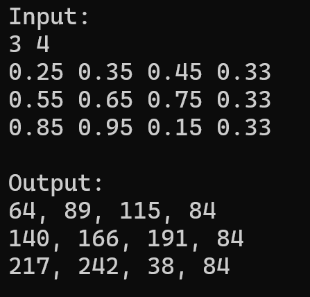

## Group Members
- Gonzales, Anja Gabrielle N.
- Rocha, Angelo H.

## Execution Time and Analysis Performance

| Matrix Size | ASM Average Execution Time | C Average Execution Time |
|-------------|----------------------------|--------------------------|
|   10 x 10   |    0.000000370 seconds     |   0.000000587 seconds    |
|  100 x 100  |    0.000008823 seconds     |   0.000032490 seconds    |
| 1000 x 1000 |    0.001039753 seconds     |   0.003097907 seconds    |     

**Analysis:** The results show that the assembly implementation of the conversion function executes much faster as compared to the C implementation. For a matrix size of 10x10, the assembly implementation is around 1.59x faster. For a matrix size of 100x100, the assembly implementation is around 3.68x faster. For a matrix size of 1000x1000, the assembly implementation is around 2.98x faster. Given these results, we can observe that by implementing the conversion function in x86-64 assembly, computation is highly optimized since scalar SIMD registers and floating-point instructions perform calculations directly in the CPU. This eliminates the overhead of C loops and array accesses, of which is the reason why the C implementation executes much slower. In conclusion, the utilization of assembly functions within C allows very fast processing even for large matrices; on the other hand, purely using C slows down execution time, which can pose even more performance issues as matrix sizes get larger and larger.

## Correctness Check

The screenshot below shows the input (height, width, double float pixel values) and the corresponding output (uint8 integer values) generated by the assembly conversion function.

  

## Demo video

- Link to demo video: https://drive.google.com/file/d/1aDAMxxu1mFOs-sAGZuVpxKe3hTT_jG3e/view?usp=sharing
